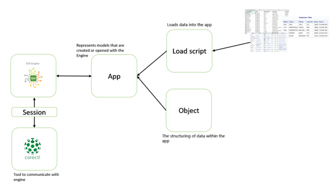

In this tutorial we will take a closer look at corectl. With corectl the user starts a session against QIX-Engine and then communicates with the engine-app through CLI commands. With the CLI commands it is possible to perform reloads, fetch metadata and evaluate expressions in the app. 
 

Here is flowchart to give you a feeling how corectl works:

In this tutorial we will walk you through how to use qlikcore, there are basically four steps in this tutorial:
1.	Setting up a session against engine and an app to communicate with. 
2.	Then load data into the app.
3.	With data loaded engine powerful inbuilt data analyzing tools will be used to study  associations, structure, etc within the loaded data.
4.	Then as a bonus step you will learn how you can integrate qlikcore and JavaScript to create visualizations 

