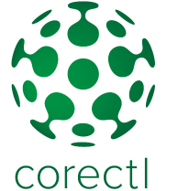

Hi and welcome to the Qlik corectl introduction tutorial.

In this tutorial you will learn how to:  
* Create a corectl configuration file
* Run corectl
* Load data with corectl
* Use the coreClt cli to analyze the data
* Load objects
* Create a simple visualization
 
 
                                                                
