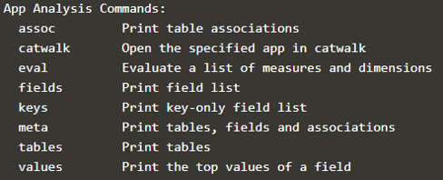

This step is about loading data into the app.  

Again [corectl config](https://github.com/qlik-oss/corectl/blob/master/docs/corectl_config.md) will be very useful
 

In this step we will continue edit the `corectl.yml`{{open}} file but we also need:  
 
**A load script**:   `testscript.qvs`{{open}}
  **Some data**: `data/movies.csv `{{open}} 
 

**Note** This data is loaded into a docker container, the internal docker container path is /data. If you are curious about the docker file check it out here `cat ../docker-compose.yml`{{execute}} 

## Setup a connection to the data

To be able to load data into your newly created app you will have to:
1. Define what load script you want to use. 
2. Then you will need to expose a connection from the engine container to the load script.

**Exercise: Add the script**

Add a script path in `corectl.yml`{{open}} pointing at  `testscript.qvs`.

 
Show solution

 
<pre class="file" data-filename="corectl.yml" data-target="append">script: testscript.qvs # Path to a script that should be set in the app
</pre>

  

**Exercise: Expose the connection**  
  Edit the `corectl.yml`{{open}} to open a connection called `testdata` against the folder `/data`.

 
Show solution

 
<pre class="file" data-filename="corectl.yml" data-target="append">
connections: # Connections that should be created in the app
  testdata: # Name of the connection
      connectionstring: /data # Connectionstring (qConnectionString) of the connection. For a folder connector this is an absolute or relative path inside of the engine docker container.
      type: folder # Type of connection

</pre>

  

 

Run `corectl build`{{execute}} to rebuild.
 

Yaaay, we loaded some data!!
 

## The load script

Before we analyze the loaded data let’s look at the `testscript.qvs`{{open}} we used. If you are familiar with SQL you will see some similarities.
 

`
Movies:  
LOAD *
FROM [lib://testdata/movies.csv]
(txt, utf8, embedded labels, delimiter is ',');
`

This script will load * (everything) from `movies.csv` at the exposed connection lib://testdata/. 
 

`lib` is a local data path specification (its `web` for webdata, etc).
 

The last line in the load script is the config. This will also depend on what data source that is used.
  
 

## Load different kinds of file types

Read more about [core data loading](https://github.com/qlik-oss/core-data-loading) to learn about loading different file types. 

## Use corectl analyzing tools 

We have now loaded data into `myapp`. A copy of the data can be seen in `data/movies.csv `{{open}}. corectl comes with a bunch of inbuilt analytics tool we can use on the loaded data.
 
If you run `corectl`{{execute}} you will see some helpful analytic tool under the heading `App Analysis Commands` 
 

**For example:**
 

`corectl fields`{{execute}} - Displays the fields in the app
 

`corectl tables`{{execute}} - Displays tables in the app
 

`corectl script get`{{execute}} - Display what load script used
 

From `corectl fields`{{execute}} we see that the app contains a field called Movie. 
 

`corectl values <field name>` - Values in a specific field
 

Using `corectl values Movie`{{execute}} will display all the top values of the Movies field.
 

**Exercise**  
As you can see there are more two more fields in our data tables, can you use `corectl values` to figure out:
 >>How many of the movies that were made in 2009?<<
[ ] One
[*] Four
[ ] Ten

 
Show solution

 
`corectl values Year`{{execute}} 

  

